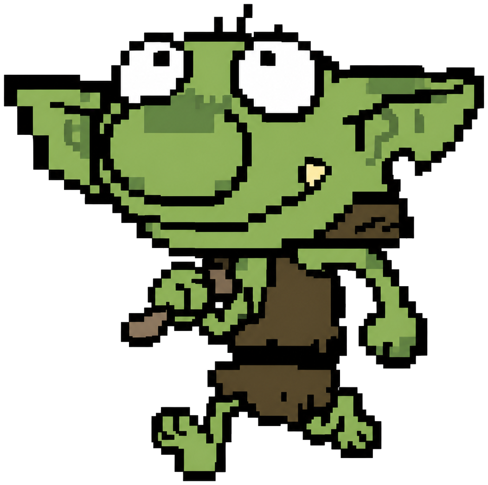

<p align="center">
  
</p>

# GRYMO

deterministic organisms with bad genetics.

GRYMO is an experimental generative system where every goblin begins with a seed.

```text
seed
  ↓
genome
  ↓
phenotype
  ↓
behaviour
  ↓
breeding
  ↓
mutation
  ↓
lineage
```

This is the technical core for [grymo.lol](https://www.grymo.lol/), not a copy of the website. This repository implements generation, breeding, kinship and lineage as reproducible functions. The browser lab adapter consumes these modules; see [the historical audit and integration status](docs/status.md).

## Run it

Requires Node.js 22.18+ (CI uses Node 24). This package is not published to npm yet. From a checkout:

```sh
npm install
npm test
npm run example
npm run example:breed
npm run example:lineage
```

`npm install` installs the compiler; it does not contact Solana, generate a wallet, or call an AI model. `npm test` builds the TypeScript and runs deterministic fixtures. `npm run example` prints a founder genome, website-compatible seed fingerprint, full-genome fingerprint and procedural SVG string.

```ts
import {
  generateGenome, breed, recordGenome, indexLineage,
  genomeFingerprint, renderSvg
} from "@theovarne/grymo";

const mother = generateGenome("118050");
const father = generateGenome("339201");
const lineage = indexLineage([recordGenome(mother), recordGenome(father)]);
const child = breed(mother, father, "741190", { lineage });

console.log(genomeFingerprint(child));
console.log(renderSvg(child));
```

For a local checkout, import from `./dist/index.js` after `npm run build`. The package name above is an **intended import shape**, not a claim that an npm release exists.

## The deterministic contract

- `generateGenome(seed)` reconstructs a founder from that seed alone.
- `breed(mother, father, eventSeed, { lineage })` reconstructs a child from **both full parent genomes**, the event seed and the same lineage input. A child's display seed alone is not enough to replay inheritance.
- No wall clock, global random source, model call, wallet, RPC, or network data affects core outputs.
- Version 1 uses the website's 32-bit UTF-16 trait hash. `siteSeedFingerprint` preserves its display format. `genomeFingerprint` identifies the full canonical genome, but is **not cryptographic** and must not secure financial or on-chain commitments.
- Tests pin founder and child golden vectors and check byte-identical replay.

## Modules

| Layer | What works now |
| --- | --- |
| Genome | Seed normalization, versioned founder genotype, site-compatible traits and visual phenotype |
| Breeding | Discrete inheritance, continuous blending, deterministic jitter, clamp |
| Mutation | Per-locus draws with lineage-derived kinship weighting; visual and behavioural events |
| Behaviour | Deterministic trait vector and local labels; no AI voice adapter |
| Lineage | Parent content IDs, local ancestry tree, serialization and kinship estimate |
| Renderer | Small deterministic SVG specimen; the website hero mark remains a separate artwork |
| Solana | **Design-only** account/seed proposal; no deployed program, PDA derivation, registry or transaction |

Read the [architecture](docs/architecture.md), [genome spec](docs/genome-spec.md), [breeding rules](docs/breeding.md), [mutation model](docs/mutations.md), [lineage model](docs/lineage.md), [renderer notes](docs/renderer.md), [Solana proposal](docs/solana.md), and [implementation status](docs/status.md).

## Scope and provenance

The initial local core was ported from the existing vanilla-JavaScript website preview after auditing `gobboo-clone/app.js`. The browser lab adapter now consumes the core modules rather than duplicating founder generation. See [browser integration](docs/browser-lab.md) for provenance and renderer versioning; deployment-specific status is shown in the website build metadata. No website UI, CSS, Goblin Speak typography, hero image, or token-control code is included here. This is pre-1.0 experimental code: schema and deterministic vectors may change only with an explicit version bump and changelog entry.

The repository is publicly readable. Reuse terms are pending the maintainer's license decision; see [LICENSE](LICENSE). Contributions are welcome through issues and pull requests under [CONTRIBUTING.md](CONTRIBUTING.md).
